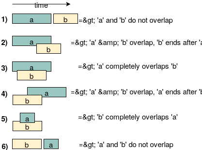

# Merge Intervals

This pattern describes an efficient technique to deal with **overlapping intervals**. In a lot of problems involving intervals, we either need to find overlapping intervals or merge intervals if they overlap.

Given two intervals (`a` and `b`), there will be six different ways the two intervals can relate to each other:

* `a` and `b` do not overlap, `a` first, `b` last
* `a` and `b` overlap, `b` ends after `a`
* `a` completely overlaps `b`
* `a` and `b` overlap, `a` ends after `b`
* `b` completely overlaps `a`
* `a` and `b` do not overlap, `b` first, `a` last

---

